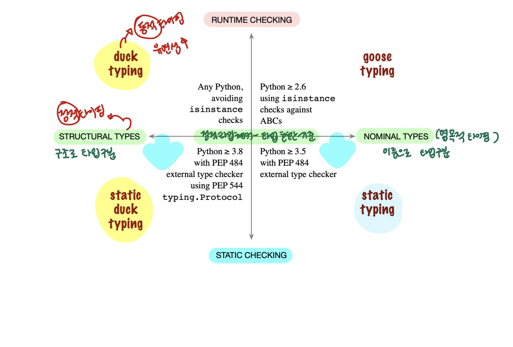

# 타입스크립트의 덕 타이핑??
## Q. "정적 타이핑을 지원하는 타입스크립트는 Duck Typing의 특성이 있고, Duck Typing은 동적 타이핑의 한 종류라고 말하니 좀 혼란스러웠다(발췌)" (내가 궁금하던 것!!!)
<br/>

- 덕 타이핑은 동적 타이핑으로 런타임 때(함수의 인자로 객체를 호출할 때 등) 타입 체크가 가능한데, 타입스크립트는 정적 타이핑 아닌가요?? (혼돈의 카오스)

<br/>

```
One of TypeScript’s core principles is that type checking focuses on the shape that values have. This is sometimes called “duck typing” or “structural typing”.

In a structural type system, if two objects have the same shape, they are considered to be of the same type.

[발췌] TypeScript Docs - Structural Type System
```  
<br/>


- 값이 가진 형태/모양으로 타입을 체크한다. 이것을 덕 타이핑/구조적 타이핑이라고 한다.
- (배경) 자바스크립트에서 덕 타이핑을 사용하고 있고, TS는 자바스크립트의 슈퍼셋(확장) 언어로 그 특성을 갖고 있음.


<br/>
<br/>


## 덕 타이핑 
```
컴퓨터 프로그래밍 분야에서 덕 타이핑(duck typing)은 동적 타이핑의 한 종류로, 객체의 변수 및 메소드의 집합이 객체의 타입을 결정하는 것을 말한다. 클래스 상속이나 인터페이스 구현으로 타입을 구분하는 대신, 덕 타이핑은 객체가 어떤 타입에 걸맞은 변수와 메소드를 지니면 객체를 해당 타입에 속하는 것으로 간주한다. 

[발췌 - 위키피디아]
```
```
interface Quackable {
	quack(): void
}

// implements/extends로 구현 -> 명시적 타입 선언
class Duck implements Quackable {
    quack() {
        console.log('Quack');
    }
}

// Duck Typing
class Person {
    quack() {
        console.log('Quack');
    }
}

function inTheForest(quackable: Quackable): void {
    quackable.quack();
}

inTheForest(new Duck()); // OK
inTheForest(new Person()); // OK
```
- 객체의 타입이 중요한 것이 아니다. 객체가 가진 형태[속성(property) + 메소드] 가 중요하다.   
- 컴퓨터 입장에선 기대하는(호출하는) 동작(속성+메소드)을 잘 실행하면 된다!
- 타입 안정성 보다는 편리함/유연함에 이점이 있다.

```
객체의 타입을 다른 타입 객체와의 명시적인 관계를 비교하는 것이 아니라, 그 객체의 메서드나 속성들을 비교함으로써 판별하는 파이썬적인 프로그래밍 스타일이다. (“오리처럼 보이고, 오리처럼 운다면 오리임에 틀림없다.”) 특정 타입 대신 인터페이스를 강조함으로써, 잘 디자인된 코드는 다형적 대체를 허용함으로써 유연성을 향상시킬 수 있다.

[발췌] 파이썬 튜토리얼 용어 항목
```
- 다형적 대체를 허용함으로써 유연성을 향상시킬 수 있다.

<br/>
<br/>
<br/>

## 덕 타이핑(duck typing) & 구조적 타이핑(structural typing) 

- (차이점) 
구조적 타이핑(Structural Typing, 정적 타이핑)과 덕 타이핑(Duck Typing, 동적 타이핑)은 비슷하지만 타입 체크 시점이 다르다!!! (대부분 혼용해서 사용하는 듯..)
- (공통점) 다형성을 허용하여 유연성을 향상시킨다.   
=> 다형성 관점에서도 생각해볼 수 있겠다!

<br/>

## 다형성
- 다양한 형태를 지닌 성질
- 객체 지향 프로그래밍에서 '외형적으로 동일한 심볼을 지녔으나 내부적으로 다른 구현을 가질 수 있는 특성'을 의미함
- 정적 다형성, 동적 다형성이 있음
=> TypeScript는 타입 체크를 정적 타입으로 하는 것!   
=> 결국은 스크립트이므로 동적 다형성을 이용함!

<br/>

<br/>

### 정적 다형성 (overloading)
- static(컴파일) 바인딩: 컴파일 때 객체의 타입이 정해짐
- 정적 다형성은 동일한 함수 이름을 가지더라도 해당 함수가 가지는 파라미터들의 개수, 타입, 순서가 다를 경우 컴파일러가 다른 함수로써 인식 하는 것을 의미함
- JS에서는 오버로딩을 바로 구현할 수 없음. 매개변수가 달라도 동일한 이름의 함수는 오버라이딩해버리므로 오버로딩처럼 구현하려면 함수 내부에서 분기 처리해야함

```
//  둘은 다른 함수로 인식함
void Func(int x);
void Func(double x); 
```

<br/>
<br/>

### 동적 다형성 (overriding)
- dynamic(런타임) 바인딩
- 동적 다형성은 동일한 함수 이름과 파라미터 특성을 지닌, 상속 관계에 있는 클래스들의 멤버 함수에 대해서 외형적으로 호출되는 타입에 상관없이 실제 생성된 객체의 함수가 호출되도록 처리 되는 특성을 의미함
- JS에서는 매개변수, 리턴 자료형을 다르게 해도 오버라이딩 가능

```
class Base
{
public:
...
virtual void Func(int x);
}

class Derived : public Base
 {
 public:
 ...
 void Func(int x);
 }

이렇게 정의를 하면

Base* p = new Derived;
p->Func(); // Derived의 Func() 실행됨
```


<br/>
<br/>

# 결론
```
TypeScript is JavaScript's runtime with a compile-time type checker.

[발췌] TypeScript Docs - TypeScript for the New Programmer
```
- 타입스크립트는 컴파일 타임 타입 체커를 가진 자바스크립트의 런타임이다.

=> 정적(컴파일) 타입 체크 시점에 사로잡혀, 타입스크립트가 동적(런타임) 언어인 스크립트임을 생각지 못한 것 
=> TypeScript는 타입 체크를 정적 타입으로 하는 것!   
=> 결국은 스크립트이므로 동적 다형성을 이용함!   
=> 타입 체크 시점과 별개로 객체의 형태/구조가 같으면 같은 타입이라고 인식하는 덕 타이핑 / 구조적 타이핑일 수 밖에 없다.

<br/>
<br/>



<br/>
<br/>
<br/>

## 정적 타이핑
- 컴파일 시에 타입이 정해짐
- 컴파일 때 타입 체크를 진행하여 실행 전에 버그를 찾아낼 수 있음

<br/>

## 동적 타이핑
- 런타임 때 값을 할당할 때 타입이 정해짐
- 대부분 스크립트 언어들은 동적 타이핑을 이용함
- 타입 선언을 필요로 하지 않는 이유? 메모리 상에서 동일한 타입으로 취급되도록 설계되어 있기 때문
- 유연한 처리가 가능하나 실행 전에 버그를 찾을 수 없음

<br/>
<br/>
<br/>

## Nominal Types
- C++, Java 등의 언어에서는 Nominal Type System을 이용함
- 이름이 다른 경우 다른 타입으로 생각하여 호환되지 않는다.
```
// pseudo code이다
class A {
	method(input: string): number {...}
}
class B {
	method(input: string): number {...}
}

let a: A = new B(); // 에러
```
<br/>

## Structural Types
- Haskell, Typescript 는 Structural Type System을 이용한다.
- 이름이 다르더라도 구조가 같으면 같은 타입으로 호환이 가능하다.
```
// pseudo code이다
class A {
	method(input: string): number {...}
}
class B {
	method(input: string): number {...}
}

let a: A = new B(); // 통과
```

<br/>
<br/>
<br/>


# 참고글
- https://www.typescriptlang.org/docs/handbook/typescript-in-5-minutes.html
- https://mygumi.tistory.com/367
- https://velog.io/@thms200/Typescript-Duck-Typing-%EB%8D%95%ED%83%80%EC%9D%B4%ED%95%91
- https://devopedia.org/duck-typing
- https://en.wikipedia.org/wiki/Duck_typing
- https://www.koffeinfrei.org/2012/03/19/static-vs-dynamic-vs-strong-vs-weak-vs-duck-typing/
- https://github.com/microsoft/TypeScript/blob/main/src/compiler/checker.ts 
- https://velog.io/@vlwkaos/Structural-vs-Nominal-Subtyping-%EA%B7%B8%EB%A6%AC%EA%B3%A0-TypeScript
- https://toss.tech/article/typescript-type-compatibility
- http://pds1.egloos.com/pds/1/200601/03/63/Polymorphism_and_function_dispatch.pdf
- https://www.zerocho.com/category/JavaScript/post/59c17a58f40d2800197c65d6
